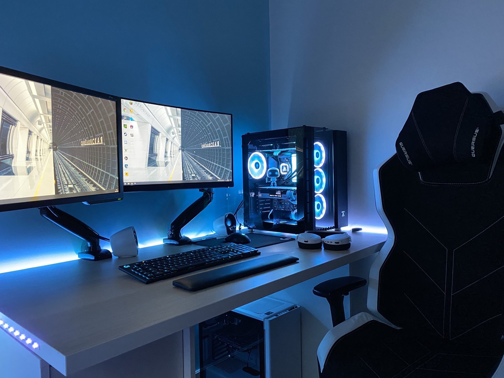

   
     
   

        
        
       
        
        
   

   ----

## 🙋 About me

- ‍🎓 I'm a self-taught passionate Full-Stack developer
- 🏠 I live in Paris, France 🇫🇷
- 💻 CEO / IT Consulting [Vassili JOFFROY](https://vassili-joffroy.fr/)
- 💼 FullStack developer at [Kang](https://kang.fr/)
- 📈 Built C3APP, F3C and more !
- ❤️ I love coding with Laravel every days & drink coffee ☕

## 🎵 Now playing

## 📊 Github Stats

   

        
        
   

## 📚 Language Usage

   
  
      
   

## 📊 Github Contribution Graph

   
  
        
   

## 🏆 Trophies

   
 
        
   

## 💻 My Setup

   

      
   

